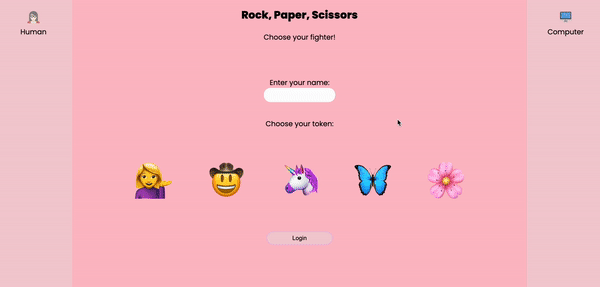

# Rock Paper Scissors

## Abstract: 
- This web application allows users to play a game of rock paper scissors. Upon page load, users will be directed to a login page, where they can enter their name and choose which token they would like to represent their player. Next, they are given the option between *classic* mode, or *hippie* mode. The classic mode allows users to play a generic game of rock paper scissors, while the hippie mode adds two additional options, love and peace! Users are provided with the rules for each game. Once the user makes a selection (rock, paper, scissors, love, or peace), the computer player will  automatically generate a random selection. The user can play against the computer as many times as they wish, and each time they win, lose, or a draw occurs, they will be presented with the results of the game, as well as a relative gif. Both players wins are tracked and displayed. Users can also switch back and forth between game modes without losing track of how many times they have won (or lost) the game. 

- A local sotrage extension was implented, so that returning users are greeted with the option to resume their previous game or start a new game. If a returning user selects to resume their previous game, they will be taken back to whichever game mode they left off at when they last played. If the returning user would like to start a new game, they will be directed to the original landing page, where they can choose either classic or hippie mode. 

<b>Built With:</b>
 
Javascript | HTML | CSS
 
<em>Additional Technologies:</em>
 
localStorage | JSON

## Installation Instructions 

- Fork this repository.
- Copy the SSH key and clone it to your local directory. 
- `cd` into the repository 
- run `open index.html` to open the site via the default browser. 
- Alternatively, one may visit the deployed page for this project [here!](https://lauraguerra1.github.io/rock-paper-scissors-project/)

## Preview of App:

## Context: 
- Mod 1, Week 5: 
  - I am a current student of Turing School of Software & Design. 
  - Turing is a 7 month program, which offers a total of 4 modules. 
  - This project was made during the fifth week of the first module that the program has to offer. 

- A total of 10-12 hours was spent on this project. 

## Contributors: 
[Laura Garcia Guerra](https://github.com/lauraguerra1)

## Learning Goals:

## Wins & Challenges: 
- <em>Biggest Win</em>: 
   - My overall biggest win was my conscious effort to only make manipulations to the DOM <em>after</em> the Data Model had been manipulated, and I made sure to manipulate the DOM based solely on the state of the application as it stood in my data model. In any instances where I initally grabbed information from the DOM, and placed it directly back on the DOM, I refactored my code in order to ensure that all DOM manipulations happened based on my data model.
- Additional Wins: 
  - The minimum viable product for this project did not include a login page, nor did it include the localStorage feature. I was able to implement both extensions in order to create a more user-friendly experience. 
  - Furthermore, I am beginning to move away from conditional logic, and intentionally reaching for `bracket notation` where possible. When I initally made the game playable through the console, I thought about all of the different conditions in which there could either be a draw, the human could win, or the computer could win. I knew that I had to come up with a more efficient way of working through the game logic than implementing a lengthy conditional statement. I am proud of my ability to condense the game logic into one object containing the possibilities for a "human win". 
  - I was able to effectively plan how my HTML and Javascript files would be written in order to coordinate with one another in an efficient manner. I gave each "fighter"'s section a class name that would coordinate with the human's selection, and accessed that class name through the `event target` when a user clicks on an image to make a selection. Furthermore, in the player object, I stored the HTML section that was selected in order to later use my data model to manipulate the DOM when the human and computer selections are displayed at the end of each turn. 
- <em>Biggest Challenge</em>: 
  - I felt that over the course of this project, getting used to the git workflow was the most challenging piece for me. I made an effort to make new branches for each feature, but I am still growing professionally and am looking forward to honing this skill. 
  - Although the successful implementation of `localStorage` was a win, I initially had some trouble with it as it was not a concept taught at this point in the Turing curicuulum. Because this was a self taught concept, I originally did not realize that local storage could only store strings. After some research, I learned to use javascript object notation to turn objects into strings and later parse them with `JSON.stringify()` and `JSON.parse()`, which allowed me to successfully implement the local storage feature. 
